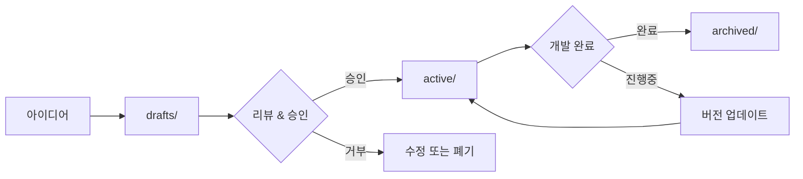

# PRD (Product Requirements Document) 관리

이 폴더는 프로젝트의 모든 PRD(제품 요구사항 문서)를 체계적으로 관리하기 위한 공간입니다.

## 📁 폴더 구조

```
docs/prd/
├── README.md          # 이 파일 (PRD 관리 가이드)
├── templates/         # PRD 템플릿 파일들
├── active/           # 현재 진행 중인 PRD들
├── drafts/           # 작성 중인 초안 PRD들
└── archived/         # 완료되거나 폐기된 PRD들
```

## 📋 각 폴더별 설명

### 🔧 templates/
- PRD 작성을 위한 표준 템플릿들을 저장
- 새로운 PRD 작성 시 이 템플릿을 복사하여 사용
- 팀 내 일관된 PRD 형식 유지를 위한 기준

### ⚡ active/
- 현재 개발 진행 중인 기능/제품의 PRD들
- 정기적으로 업데이트되고 참조되는 문서들
- 파일명 규칙: `[YYYY-MM-DD]_[기능명]_PRD_v[버전].md`

### ✏️ drafts/
- 아직 완성되지 않은 PRD 초안들
- 검토 및 승인 대기 중인 문서들
- 브레인스토밍이나 아이디어 정리 단계의 문서들

### 📦 archived/
- 개발 완료된 기능의 PRD들
- 취소되거나 폐기된 프로젝트의 PRD들
- 향후 참고용으로 보관하는 문서들

## 📝 PRD 작성 가이드라인

### 1. 새로운 PRD 작성 시
1. `templates/` 폴더에서 적절한 템플릿을 선택
2. `drafts/` 폴더에 복사하여 작성 시작
3. 초안 완성 후 팀 리뷰 진행
4. 승인 완료 시 `active/` 폴더로 이동

### 2. 파일명 규칙
- **활성 PRD**: `[YYYY-MM-DD]_[기능명]_PRD_v[버전].md`
  - 예: `2024-06-19_밈생성기능_PRD_v1.2.md`
- **초안 PRD**: `[YYYY-MM-DD]_[기능명]_PRD_draft.md`
  - 예: `2024-06-19_밈생성기능_PRD_draft.md`
- **아카이브 PRD**: `[YYYY-MM-DD]_[기능명]_PRD_v[최종버전]_archived.md`
  - 예: `2024-06-19_밈생성기능_PRD_v2.0_archived.md`

### 3. 버전 관리 규칙
- **v1.0**: 최초 승인된 PRD
- **v1.x**: 소규모 수정 (요구사항 추가/수정)
- **v2.0**: 대규모 변경 (전체 구조 변경, 주요 기능 추가/삭제)

## 🔄 PRD 생명주기 관리



## 📊 PRD 상태 추적

각 PRD는 다음 상태 중 하나를 가집니다:

| 상태 | 설명 | 위치 |
|------|------|------|
| 🔄 Draft | 작성 중 | drafts/ |
| ✅ Active | 진행 중 | active/ |
| 🏁 Completed | 개발 완료 | archived/ |
| ❌ Cancelled | 취소/폐기 | archived/ |

## 📅 정기 리뷰 프로세스

### 주간 PRD 리뷰 (매주 금요일)
- [ ] active/ 폴더의 모든 PRD 상태 확인
- [ ] 완료된 PRD를 archived/로 이동
- [ ] 새로운 요구사항 변경사항 반영
- [ ] 다음 주 우선순위 조정

### 월간 PRD 정리 (매월 말)
- [ ] archived/ 폴더 정리
- [ ] 템플릿 업데이트 검토
- [ ] PRD 작성 프로세스 개선사항 논의

## 🛠️ 사용 도구 및 연동

- **문서 작성**: Markdown 형식 권장
- **협업**: GitHub Issues/Projects와 연동
- **리뷰**: Pull Request를 통한 변경사항 관리
- **알림**: Slack/Teams 채널 연동 (선택사항)

## 📞 문의 및 지원

PRD 관리와 관련된 문의사항이 있으시면:
- 프로젝트 매니저에게 문의
- GitHub Issues에 질문 등록
- 팀 회의에서 논의

---

**마지막 업데이트**: 2025-06-19  
**관리자**: 프로젝트 팀  
**버전**: v1.0 